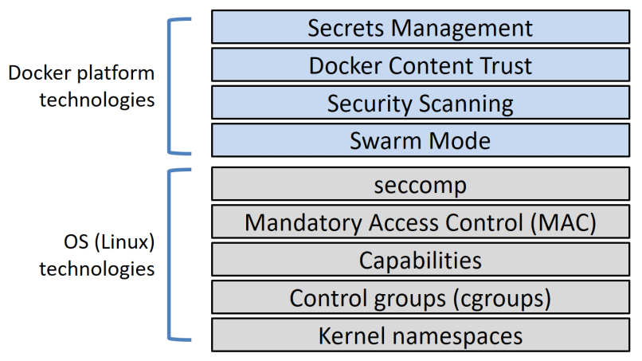
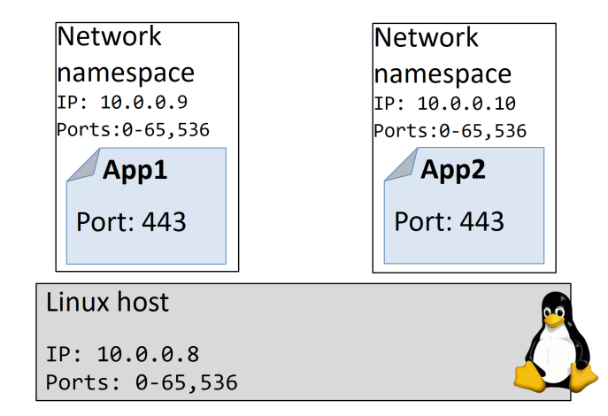
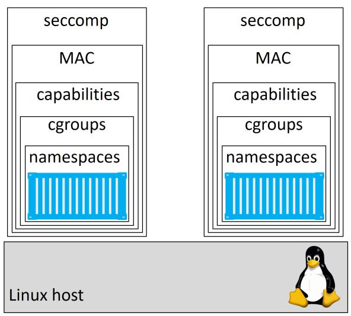

## Giới thiệu

Docker sử dụng rất nhiều công nghệ bảo mật. Trong phần này, chúng ta sẽ xem các công nghệ đó là gì và chúng hoạt động như thế nào để bảo mật cho container.

## Cơ bản

Docker bao gồm rất nhiều lớp bảo mật. Hình sau đây là các công nghệ bảo mật của Docker để cho bạn có cái nhìn tổng quan.

Từ hình trên, ta có 02 nền tảng bảo mật:

- Docker platform technologies

- OS (linux) technologies

Docker dựa vào các công nghệ bảo mật của (OS) Linux. Chúng bao gồm: namespace, control groups (cgroups), capabilities, madatory access control (MAC) systems, và seccomp.

Ngoài ra, Bản thân Docker cũng cung cấp một số công nghệ bảo mật tuyệt vời, và chúng cũng cực kỳ đơn giản khi sử dụng.

- **Docker Swarm Mode**: là một bảo mật mặc định. Bạn có thể sử dụng những điều sau mà không yêu cầu thêm bất kỳ cấu hình nào: cryptographic node IDs, mutual authentication, automatic CA configuration, automatic certificate rotation, encrypted cluster store, encrypted networks
 
- **Docker Content Trust (DCT)**: cho phép bạn ký vào các image do bạn tạo ra, xác minh tính toàn vẹn và nguồn gốc các image mà bạn kéo về.

- **Docker Security Scanning**: phân tích các image Docker, xác định các lỗ hổng đã biết và cung cấp báo cáo chi tiết.

- **Docker secrets**: tạo ra lớp bảo mật đầu tiên trong hệ sinh thái Docker. Chúng được lưu trữ trong phần lưu trữ được mã hoá, được mã hoá khi phân phối tới container, được lưu trữ trong bộ nhớ filesystems khi sử dụng, và vận hành ở mô hình ít ưu tiên nhất.

Docker sử dụng các công nghệ bảo mật của Linux là chính, mặc dù chúng khá phức tạp để cấu hình. Sau đây, chúng ta sẽ đi sâu vào các lớp bảo mật.

## Nâng cao

Trong phần tiếp theo chúng ta sẽ đi vào chi tiết từng lớp bảo mật.

- Linux security technologies:
    - Namespaces
    - Control groups
    - Capabilities
    - Mandatory Access Control
    - seccomp
    
-  Docker platform security technologies
    - Swarm mode
    - Docker security Scanning
    - Docker content trust
    - Docker secrets
    
### Linux security technologies

#### Namespaces

Kernel namespace là trung tâm của container. Chúng cho phép chia một OS thành ra như là nhiều OS riêng biệt. Chúng cho phép chạy nhiều web server mà không xảy ra xung đột cổng. Nó còn cho phép chạy nhiều ứng dụng trên cùng OS mà không bị xung đột với các file và libraries dùng chung.

Ví dụ:

- Bạn có thể chạy nhiều web server, mỗi cái sẽ có port 443 trên cùng một OS. Để làm điều này, bạn phải chạy web server trong một `network namespace` riêng. Mỗi `network namespace` sẽ có địa chỉ IP riêng và dải port riêng. Bạn có thể ánh xạ mỗi port riêng biệt vào Docker host. mỗi khi bạn chạy một webserver thì bạn phải cấu hình để ánh xạ port 443 ra port khác nhau ở Docker host.

- Bạn có thể chạy nhiều ứng dụng, mỗi cái sẽ yêu cầu các phiên bản khác nhau của file cấu hình và library. Để làm điều này, bạn chạy mỗi ứng dụng trong một `mount namespace` riêng. Mỗi mount namespace sẽ có một bản sao lưu riêng mọi thư mục của system. (ví dụ: /etc, /var, /dev,...)

Hình sau sẽ chỉ ra cách thức chạy 02 webserver trên một host và đều sử dụng port 443. Mỗi web server chạy trong một network namespace riêng.

Docker sử dụng một số kernel namespace sau:

- Process ID (pid)
- Network (net)
- Filesystem/mount (mnt)
- Inter-process Communication (ipc)
- User (user)
- UTS (uts)

Sau đây là một số mô tả ngắn gọn về mỗi namespace:

- `Process ID namespace`: Docker sử dụng pid namespace để cung cấp các cây process riêng biệt cho mỗi container. Mỗi container sẽ có một process tree riêng, nghĩa là mọi container đều có thể có PID riêng là 1. PID namespace cũng cúa nghĩa là một container không thể nhìn hoặc truy cập vào một process tree của container khác hay vào host đang chạy.

- `Network namespace`: Docker sử dụng net namespace để cung cấp cho mỗi container một tập các network riêng biệt. Tập này bao gồm: interface, IP address, port range, routing table. Ví dụ mỗi container đều có interface `eth0` với địa chỉ IP duy nhất và dải port riêng.

- `Mount namespace`: Mọi container đều có một root / filesystem riêng biệt. Điều này nghĩa là mọi container đều có /etc, /var, /dev,... riêng. Các tiến trình bên trong một container không thể truy cập vào mount namespace của linux host cũng như container khác. Chúng chỉ có thể xem và truy cập vào mount namespace của riêng nó

- `Inter-process Communication namespace`: Docker sử dụng ipc namespace để chia sẻ vùng nhớ bên trong mỗi container. Nó cũng cách ly container khỏi bộ nhớ chia sẻ bên ngoài.

- `User namespace`: Docker sử dụng user namespace để ánh xạ người dùng bên trong container với người dùng khác ở Linux host. ví dụ đơn giản là ánh xạ người dùng `root` trong container với user non-root trên Linux host. User namespace thì vẫn còn khá mới với Docker và là một tuỳ chọn ở thời điểm hiện tại. Trong tương lai có thể sẽ thay đổi.

- `UTS namespace`: Docker sử dụng uts namespace để cung cấp cho mỗi container một hostname riêng.

Nhớ rằng: một container là một tập có tổ chức các namespace.

Tìm hiều thêm các bài về namespace ở link sau:

- [https://pierrchen.blogspot.com/2018/08/understand-container-index.html](https://pierrchen.blogspot.com/2018/08/understand-container-index.html)

- [https://blog.yadutaf.fr/page/2/](https://blog.yadutaf.fr/page/2/)

#### Control Groups

Nếu namespace là về tách biệt, cô lập thì control groups (cgroups) là về thiết lập giới hạn.

Hãy nghĩ về container tương tự như các phòng trong một khách sạn, vâng, các phòng thì được cô lập nhưng mỗi phòng đều sử dụng chung một tập các tài nguyên như: nước, điện, hồ bơi, phòng gym, quầy bar. Cgroup cho phép bạn giới hạn nhưng thứ này. không một container nào có thể sử dụng tất cả mọi thứ như nước hoặc ăn mọi thứ ở quầy bar.

Trong thế giới thực, container được tách biệt với nhau nhưng vẫn sử dụng chung một tập các tài nguyên của OS như: CPU, RAM, disk I/O. Cgroup cho phép bạn giới hạn mỗi thứ để một container không thể sử dụng tất cả các CPU, RAM, storage I/O của host.

#### Capabilities

Rất tệ khi chạy container với quyền root. Root có toàn quyền do đó nó rất nguy hiểm. Nhưng cũng ko thoải mái khi chạy container với non-root vì non-root rất ít quyền, đôi khi không hữu ích. Những gì chúng ta cần là công nghệ cho phép chúng ta chạy container với quyền root khi cần. đó là `capabilities`.

Linux root có liệt kê ra một số khả năng như:
- `CAP_CHOWN`: cho phép bạn thay đổi quyền sở hữu file
- `CAP_NET_BIND_SERVICE`: cho phép bạn kết nối một socket với một số port
- `CAP_SETUID`: cho phép bạn nâng quyền cho một tiến trình
- `CAP_SYS_BOOT` cho phép bạn khởi động lại hệ thống

Danh sách còn nhiều.

Docker làm việc với capabilities để bạn có thể chạy container như root nhưng loại bỏ các capabilities của root mà bạn không cần. Ví dụ: nếu container chỉ cần khả năng của root để bind vào một port, bạn nên khởi động một container và loại bỏ tất cả các capabilities của root, và add ngược lại `CAP_NET_BIND_SERVICE` capability.

Docker cũng áp đặt các hạn chế để các container không thể thêm hoặc bỏ các capabilities.

#### Mandatory Access Control system

Docker làm việc với công nghệ MAC như: AppArmor và SELinux.

Phụ thuộc vào bản phân phối Linux, Docker sẽ sử dụng một profile AppArmor mặc định cho tất cả các container. 

Docker cũng cho phép bạn khởi động một container mà không cần phải dùng một policy, cũng như cho  bạn khả năng tuỳ biến các policy phù hợp với những yêu cầu đặc thù.

#### seccomp

Docker sử dụng seccomp, trong chế độ lọc, để giới hạn syscall một container có thể làm với host's kernel.

Theo như triết lý bảo mật của Docker, tất cả các container mới để có seccomp profile cấu hình mặc định phù hợp. Điều này nhằm cung cấp bảo mật vừa phải mà không ảnh hưởng tới khả năng tương thích của ứng dụng. 

Như mọi khi, bạn có thể tuỳ tình seccomp profile và bạn có thể bỏ qua cho Docker sử dụng seccomp profile bằng một cờ khi khởi chạy container

#### Kết luận về Linux security technologies

Docker hỗ trợ hầu hết các công nghệ bảo mật quan trọng của Linux và chuyển chúng cho container bằng các cấu hình mặc định hợp lý nhưng không quá bị giới hạn.

Một số công nghệ này có thể khá phức tạp để tuỳ chỉnh, vì cần phải có kiếu thức chuyên sâu về chúng. Trong tương lai có thể sẽ cấu hình đơn giản hơn nhưng hiện tại thì bạn có thể sử dụng các cấu hình đã được thiết lập mặc định.

Trong bài tiếp theo tôi sẽ trình bày về Docker platform security technologies.

## Tham khảo
- Ebook: Docker deep dive 
