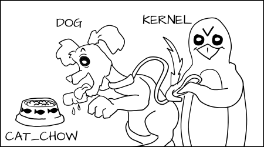
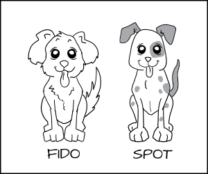
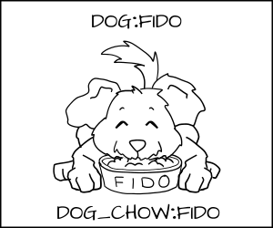
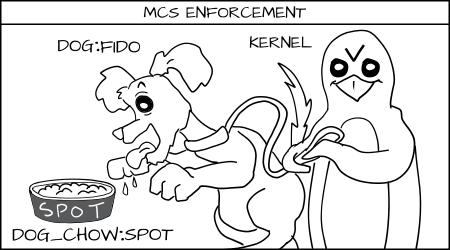

# Giới thiệu

Khi chạy container trên các distro Linux, ta sẽ thấy đề cập tới vấn đề bảo mật cho các container này. Đội ngũ phát triển sử dụng kỹ thuật có sẵn trong Linux để thực hiện các biện pháp bảo mật.

Với Ubuntu, họ sử dụng Apparmor, còn với CentOS thì họ sử dụng SElinux.

Vậy SElinux là gì? SElinux hoạt động như thế nào? Tại sao nó lại có khả năng security cho các Container?

# SElinux là gì?

SElinux là một hệ thống ghi nhãn. Mỗi process đều có một nhãn. Mỗi file/directory trong hệ điều hành đều có một nhãn. Ngay cả các cổng mạng, thiết bị, tên máy chủ đều có nhãn được gán cho chúng. Chúng ta viết các rule để điều khiển truy cập của các process label tới các object label như file. Chúng ta gọi đó là `policy`. Kernel sẽ thực thi các rule này. Đôi khi việc thực thi này gọi là `Mandatory Access Control (MAC)`.

Chủ sở hữu của một object thì ko có quyền quyết định đối với các thuộc tính bảo mật (security attributes) của object đó. Linux điều khiển quyền truy cập thông qua các cờ như `rwx`, thường được gọi là `Discretionary Access Control (DAC)`. SElinux thì không có khái niệm về UID hoặc quyền sở hữu file. Tất cả mọi thứ được kiểm soát bởi các nhãn. Nghĩa là một hệ thống SElinux có thể được thiết lập mà không cần một tiến trình có các quyền của `root`.

**Chú ý**: SElinux không cho phép bạn điều khiển ở bước DAC. SElinux là một mô hình thực thi song song. Một ứng dụng phải được cả SElinux và DAC cho phép thực hiện. Điều này có thể dẫn tới sự nhầm lẫn cho người quản trị khi thấy một tiến trình bị `Permission Denied`, có nghĩa là đang bị lỗi DAC chứ không phải SElinux.

# Type enforcement

Nhìn xa hơn một chút vào label, mô hình chính hoặc thực thi của SElinux được gọi là `type enforcement`. Về cơ bản, điều này có nghĩa là chúng ta xác định label trên một process cơ bản và label của nó trên file system của loại object đó.

## Analogy

Hãy tưởng tượng một hệ thống mà chúng ta định nghĩa type của object là `cat` và `dog`. `cat` và `dog` là process type.


Chúng ta có class của object mà các process muốn tương tác là `food`. và chúng ta thêm type cho food là `cat_food` và `dog_food`.


Là một người viết các policy, tôi sẽ nói rằng một con `dog` được phép ăn thức ăn `dog_chow` và một con `cat` được phép ăn thức ăn `cat_chow`. Trong SElinux chúng ta sẽ viết các rule trong policy


```sh
allow cat cat_chow:food eat;

allow dog dog_chow:food eat;
```

Với những rule này, kernel sẽ cho phép `cat process` ăn food có gán label `cat_chow` và `dog process` ăn food có label `dog_chow`.


Trong một hệ thống SElinux, mặc định mọi thứ đều bị từ chối. Điều này có nghĩa là nếu `dog process` cố găng ăn `cat_chow` thì kernel sẽ ngăn chặn nó.



Ngược lại, `cat` cũng không được phép động tới đồ ăn của `dog`


## Real world

Chúng ta gán nhãn cho các process Apache là httpd_t và nhãn cho content Apache là `httpd_sys_content_t` và `httpd_sys_content_rw_t`. Hãy tưởng tượng chúng ta có dữ liệu thẻ tín dụng lưu trữ trong DB MySQL được gán nhãn là `mysqld_data_t`. Nếu một Apache process bị hack, tin tặc có thể kiểm soát tiến trình `httpd_t` và được phép đọc các tệp `httpd_sys_content_t` và `httpd_sys_content_rw_t`. Nhưng tin tặc sẽ không được phép đọc dữ liệu thẻ tín dụng (`mysqld_data_t`) ngay cả khi process đang chạy bằng `root`. Trong trường hợp này, SElinux đã giảm nhẹ việc bị `break in`.

# MCS enforcement

## Analogy

Ở trên, chúng ta đã có `dog process` và `cat process`, nhưng điều gì xảy ra nếu bạn có nhiều `dog process`: Fido và Spot. Bạn muốn ngăn Fido ăn `dog_chow` của Spot.


Giải pháp ở đây là tạo ra nhiều `type` như: Fido_dog, Fido_dog_chow. Nhưng điều này trở nên bất cập vì tất cả các dog đều có khá nhiều quyền giống nhau.

Để xử lý vấn đề này, chúng ta triển khai một hình thức thực thi mới, gọi là `Multi Category Security (MCS)`. Trong MCS, chúng ta thêm một phần khác của label mà có thể áp dụng cho `dog process` và cho `dog_chow`. Bây giờ chúng ta dán nhãn cho `dog process` là `dog:random1` (Fido) và `dog:random2` (Spot)



Chúng ta đánh nhãn dog chow là `dog_chow:random1` (Fido) và `dog_chow:random2` (Spot)


MCS rule sẽ cho biết rằng nếu type enforcement là OK và random MCS label khớp chính xác, thì truy cập được phép, nếu không nó sẽ bị từ chối.

Fido (dog:random1) đang cố gắng ăn `cat_chow:food` bị từ chối bởi type enforcement:


Fido (dog:random1) được phép ăn `dog_chow:random1`:



Fido (dog:random1) bị từ chối khi ăn đồ của Spot (dog_chow:random2):



## Real world

Trong hệ thống máy tính, chúng ta thường có rất nhiều process có cùng quyền truy cập, nhưng chúng ta muốn chúng tách biệt với nhau. Đôi khi chúng ta gọi đây là multi-tenant environment. 

Ví dụ tốt nhất về điều này là virtual machine. Nếu tôi có một Server chạy nhiều VM, và một trong số chúng bị hack. Tôi muốn ngăn chặn nó tấn công các VM khác và VM image. Nhưng trong một hệ thống type enforcement, các máy ảo trong KVM được gán nhãn `svirt_t` và image được gán nhãn `svirt_image_t`. Chúng ta có một rule nói rằng `svirt_t` có thể read/write/delete content được gán nhãn `svirt_image_t`. 

Với libvirt, chúng ta đã thực hiện không chỉ type enforcement mà còn tách MCS. Khi libvirt chuẩn bị khởi chạy một máy ảo, nó chọn ra một nhãn MCS ngẫu nhiên như s0:c1,c2 sau đó nó gán nhãn svirt_image_t:s0:c1,c2 cho tất cả content mà máy ảo cần quản lý. Cuối cùng, nó khởi chạy VM với svirt_t:s0:c1,c2. Khi đó, SElinux kernel điều khiển Svirt_t:s0:c1,c2 không thể ghi vào svirt_image_t:s0:c3,c4 ngay cả khi VM bị tin tặc kiểm soát và chiếm đoạt, ngay cả khi nó đang chạy ở `root`.

# MLS enforcement

Một hình thức thực thi khác của SElinux, ít được sử dụng, gọi là `Multi Level Security (MLS)`; nó được phát triển lại vào những năm 60 và được sử dụng chủ yếu trong các hệ điều hành đáng tin cậy như `Trusted Solaris`.

Ý tương chính là kiểm soát các quá trình dựa trên mức độ dữ liệu mà họ sẽ sử dụng. một secret process không thể đọc được secret data.

MLS rất giống với MCS, ngoài trừ nó thêm một khái niệm về sự thống trị để thực thi (dominance to enforcement). Trong đó, các nhãn MCS phải khớp chính xác, một nhãn MLS có thể thống trị (dominance) một nhãn MLS khác và có quyền truy cập.

## Analogy


# Tham khảo

- [https://opensource.com/business/13/11/selinux-policy-guide](https://opensource.com/business/13/11/selinux-policy-guide)