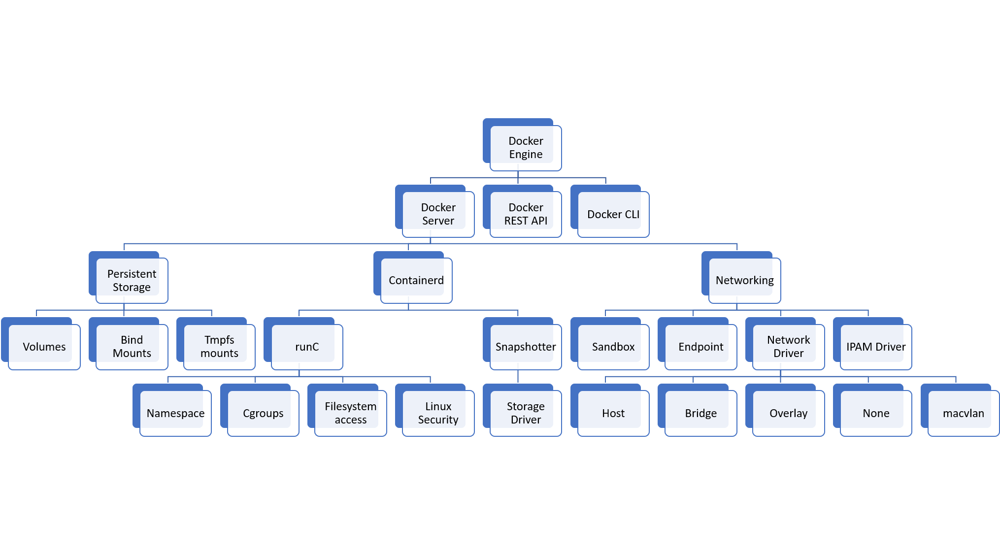
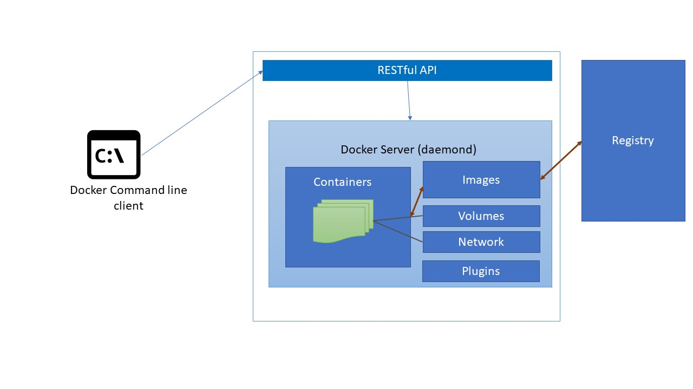
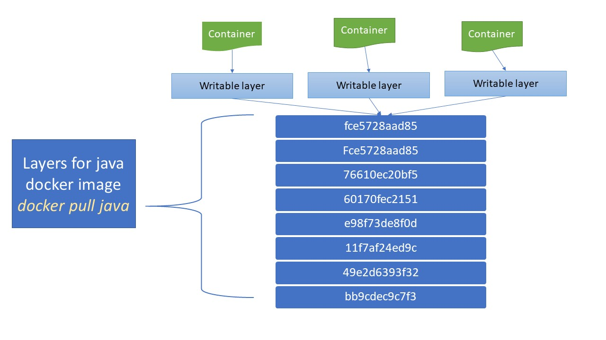
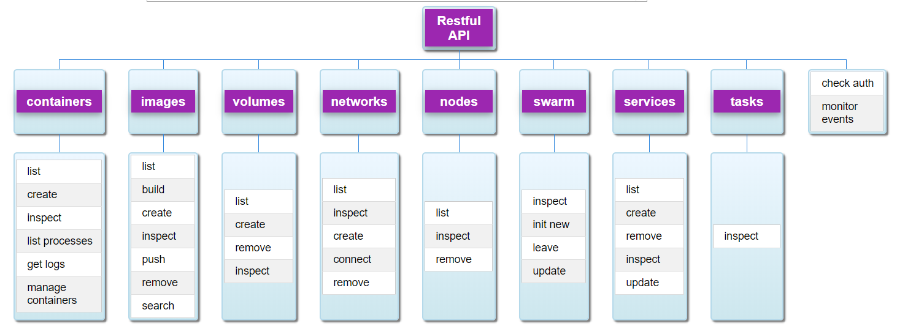

# Giới thiệu

Có thể mọi người thường bị bối rối khi nhìn vào kiến trúc của Docker về những gì các thành phần của nó làm. Trong bài này, tôi sẽ cố gắng làm sáng tỏ một vài thành phần. Phiên bản Docker khi viết bài này là 18.09

Đây là một hệ thống phân cấp tổng thể của Docker

Trái tim của Docker là docker engine-containerd-runc/

# 1. Docker Engine

Docker Engine bao gồm các thành phần:

- Docker Server được triển khai bằng dockerd hoặc docker deamon. Nó chịu trách nhiệm tạo ra image, container, network, volume
- RESTFull API để nói chuyện với Docker Server
- Docker command line client để nói chuyện với Docker Server thông qua dòng lệnh.

## 1.1 Docker Server

Docker Server đảm nhiệm việc: tạo, duy trì các container bằng cách sử dụng containerd, networking, persistent storage, Orchestration và Distribution.

### 1.1.1 Persistent storage

File System trong Docker được quản lý bởi container runtime và nó sử dụng một Storage Driver để ghi vào container writeable layer. Tuy nhiên để lưu trữ dữ liệu một cách lâu dài cho container sẽ có 03 tùy chọn: volumes, bind mounts và tmpfs mounts.

#### 1.1.1.1 Volumes

Docker Server đảm nhiệm việc duy trì các volume và chúng được quản lý bằng API hoặc Client. Các volume có thể được chia sẻ giữa nhiều container và hoạt động trên cả linux, windows, thâm chí cả remote hosts hoặc cloud providers. Các volume được tạo ra trên host nhưng được quản lý bởi docker và tuổi thọ của nó độc lập với vòng đời của container. Một volume có thể được gắn cho nhiều container trên các remote host hoặc cloud provider bằng cách sử dụng volume driver.

#### 1.1.1.2 Bind Mounts

Bạn có thể gắn một file hoặc thư mục từ host machine vào trong docker container bằng cách sử dụng bind mounts. Chúng bị giới hạn về chức năng so với volumes và sử dụng được dẫn file hoàn chỉnh của host system. Các Volume được ưu tiên để bind mounts cho các ứng dụng mới.

#### 1.1.1.3 tmpfs Mounts

Cách thức lưu trữ này có thể được sử dụng để lưu trữ dữ liệu tạm thời vì dữ liệu không được lưu trên ổ cứng mà được lưu trên vùng lưu trữ tạm thời của host machine.

### 1.1.2 Networking

Sơ đồ dưới đây từ tài liệu về docker để giải thích cho cách thức network trong docker hoạt động.

Chúng ta sẽ không đi vào chi tiết của kiến trúc network này mà chỉ đi vào các thành phần chính.

#### 1.1.2.1 Sandbox

Đây là network cho chính container. Nó quản lý các bảng route, interface và thiết lập DNS của container

#### 1.1.2.2 Endpoint

Endpoints tham gia vào một network của sandbox. Mục tiêu chính của nó là trừu tượng hóa việc thực hiện trình điều khiển.

#### 1.1.2.3 Network Driver

Network Driver được sử dụng bởi docker engine để kết nối vào hạ tầng network thực tế. Có hai loại network driver là native và remote. Native driver có mặt bên trong Docker Engine và các remote driver được duy trì bởi cộng đồng và các vendor. 

Các native driver có các loại sau:

- Host: Container sử dụng chính network của host
- Bridge: Container tạo ra một linux bridge. Các container sẽ nói chuyện với nhau thông qua bridge này.
- Overlay: Tạo ra một overlay network để hỗ trợ kết nối nhiều host với nhau.
- MACVLAN:
- None: Tạo ra các network và namespace nhưng không cung cấp cho container giao diện. Các container đó hoàn toàn bị cô lập.

#### 1.1.2.4 IPAM Driver

Quản lý địa chỉ IP cho Docker

### 1.1.3 Containerd

Trái time của hệ thống container là containerd. Nó là container runtime cho docker engine sử dụng để tạo và quản lý các container. Nó trừu tượng hóa các lời gọi tới chức năng cụ thể của system hoặc OS để chạy container trên windows, solaris và OS khác. Phạm vi của containerd bao gồm các thứ sau:

- Create, start, stop, pause, resume, signal, delete một container
- Chức năng cho overlay, aufs và copy-on-write file system khác cho các container
- Build, push, pull images và quản lý các image
- Container level metrics
- Tạo và quản lý các interface network
- Persistent container logs

Containerd được giới hạn trên một host. Trong bài này, chúng ta sẽ thảo luận về hai tính năng chính: snapshotter và runtime.

#### 1.1.3.1 Container runtime - runC

Container runtime được thực hiện thông qua runC. runC là một CLI tool tuân theo đặc tả của OCI ở [https://www.opencontainers.org/](https://www.opencontainers.org/) . Các OSI cung cấp đặc tả cho runtime (runtime-spec) và image (image-spec). runC theo dõi runtime-spec.

runC cung cấp GO implementation để tạo container bằng cách sử dụng namespace, cgroup, filesystem access control và linux security capabilities. Để biết thêm thông tin thì xem đặc tả libContainer (tiền thân của runC) ở [https://github.com/opencontainers/runc/blob/master/libcontainer/SPEC.md](https://github.com/opencontainers/runc/blob/master/libcontainer/SPEC.md)

#### 1.1.3.2 Snapshotter

Docker container sử dụng một system được biết như layers. các layer cho phép thực hiện sửa đổi một file system và lưu trữ chúng như một dạng thay đổi ở một base layer trên cùng. Trước đó Docker sử dụng graphdriver để tạo ra snapshots, tuy nhiên, hiện giờ containerd sử dụng snapshotter.

Một snapshot là một trạng thái filesystem. Mỗi snapshot có một cha và khi không có cha sẽ là một chuối rỗng. Một layer chia tách giữa các snapshot. Khi một container được tạo, nó thêm vào một writeable layer (lớp có thể ghi) vào đỉnh của tất cả các layer. Tất cả các thay đổi được ghi vào writeable layer này. Writeable layer này là những gì khác biết của một container và một image.

Tất cả các container sử dụng chung các layer cơ bản. Nếu một layer cần thay đổi, khi đó một layer mới được tạo ra như một bản copy của layer đó (và tất cả các layer trên đỉnh của nó) và thêm vào các thay đổi trong layer mới. Những layer mới này được hiển thị trong container yêu cầu thay đổi và những container khác vẫn sử dụng layer gốc. Nếu bạn kiểm tra hai image từ docker repository và nếu hai image có chung các base layer thì docker sẽ chỉ tải xuống các layer chung đó một lần.

Có nhiều loại driver khác nhau thực hiện chức năng này. Docker sử dụng một chiến lược cắm nhả để các storage driver có thể được thay đổi. Các storage driver được hỗ trợ là overlay2, aufs (sử dụng bởi các version cũ), devicemapper (CentOS và RHEL cũ), btrfs và zfs nếu các host sử dụng chúng và vfs cho thử nghiệm.

## 1.2 Docker RESTFull API

Docker API nhận lệnh từ client và chuyển chúng cho daemon. Các endpoint chính mà API phơi ra tương ứng là:

- Containers: list, create, inspect, list processes, get logs, manage container
- Images: list, build, create, inspect, push to registry, remove, search
- Check auth
- Monitors events
- Volumes: list, create, inspect, remove
- Networks: list, inspect, create, connect container, remove
- Nodes: list, inspect, remove
- Swarm: inspect, init new, leave, update
- Services: list, create, remove, inspect, update
- Tasks: inspect

## 1.3 Docker command line client

Như sơ đồ đã chỉ ra, người dùng gửi lệnh tới docker server sử dụng command line client được gọi là docker. Lệnh được nhận bởi Docker RESTFull API, lần lượt chỉ dẫn cho daemon thực hiện các tác vụ. Để xem danh sách các lệnh thì chạy lệnh `docker --help`

# Tham khảo
- [http://www.studytrails.com/devops/docker-architecture-engine-containerd-runc/](http://www.studytrails.com/devops/docker-architecture-engine-containerd-runc/)
